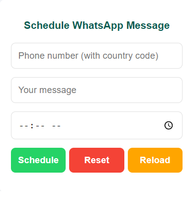

# WhatsApp Scheduler Chrome Extension

## Overview

This Chrome extension allows users to schedule WhatsApp messages by opening WhatsApp Web, pre-filling the message, and automatically sending it at the scheduled time. It includes functionalities for resetting the form, reloading the extension, and scheduling messages to specific contacts.

## Features

- **Schedule Messages**: Enter a phone number, message, and time to schedule a message for WhatsApp Web.
- **Automatic Send**: Once the scheduled time is reached, the message is automatically sent by simulating a button click on WhatsApp Web.
- **Reset Form**: Clear all input fields with a single click.
- **Reload Extension**: Start fresh by reloading the extension interface.

---

## Screenshots

  
*Example of the interface where users can schedule a message, reset the form, or reload the extension.*

---

## Installation

1. **Clone or Download** the repository to your local machine.

    ```bash
    git clone https://github.com/your-username/whatsapp-scheduler-extension.git
    ```

2. **Go to Chrome Extensions**:

    Open Chrome and navigate to `chrome://extensions/`.

3. **Enable Developer Mode**:

    Turn on Developer Mode by toggling the switch in the top-right corner.

4. **Load Unpacked Extension**:

    Click on **Load unpacked** and select the folder where you cloned/downloaded this project.

5. **Run the Extension**:

    Once loaded, the extension will appear in the Chrome toolbar. Click on the extension icon to open it.

---

## Usage

1. **Open WhatsApp Scheduler**:
   - Click on the Chrome extension icon to open the WhatsApp Scheduler popup.

2. **Enter Phone Number**:
   - Enter the recipient's phone number in international format (e.g., `+1234567890`).

3. **Enter Message**:
   - Type in the message you wish to send.

4. **Set Time**:
   - Choose the time (in 24-hour format) at which you want to send the message.

5. **Click "Schedule"**:
   - The message will be scheduled, and at the specified time, WhatsApp Web will open with the message pre-filled and sent.

6. **Reset or Reload**:
   - Use the **Reset** button to clear the form or the **Reload** button to start fresh.

---

## Project Structure

- **manifest.json**: Defines the Chrome extension's metadata and permissions.
- **popup.html**: The user interface for the extension, where users input message details.
- **popup.js**: Contains JavaScript logic to handle form submissions and reset/reload actions.
- **background.js**: Handles scheduling logic, opening WhatsApp Web, and automating message sending.
- **content.js**: Injects code into WhatsApp Web to simulate clicking the "Send" button.

---

## Contributing

Feel free to fork this repository and submit pull requests. All contributions are welcome!

1. Fork the project.
2. Create your feature branch (`git checkout -b feature/YourFeature`).
3. Commit your changes (`git commit -m 'Add some feature'`).
4. Push to the branch (`git push origin feature/YourFeature`).
5. Open a pull request.

---

## License

This project is licensed under the MIT License. See the [LICENSE](LICENSE) file for details.

---

## Acknowledgements

- **pywhatkit**: For providing WhatsApp Web interaction functionality.
- **Google Chrome Extensions**: For making it possible to build this extension.
